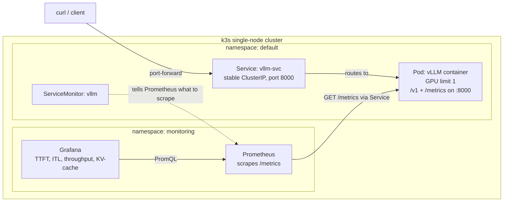

# llm-serving-vllm-k8s

Serving a small open LLM behind vLLM on a single-node k3s cluster, with Prometheus and Grafana for observability. Built on an 8GB desktop GPU to learn the serving and ops layer end to end, not as a production system.

**Status:** serving and monitoring are built and working. The load benchmark is scoped but not yet run (see Roadmap).

## Links to Blog Posts:
[1. Building a multi-stage Docker image for locally serving an LLM]()  
[2. Spinning up a simple k3s to manage a local LLM Docker Container](https://aadi-blogs.web.app/blog/intro-to-k3s/)  
[3. Spinning up a simple k3s to manage a local LLM Docker Container](https://aadi-blogs.web.app/blog/basic-k3s-monitoring/)

## What this is
A data scientist's walk into the ML-engineering half of the job: take a model, containerize it, schedule it on a GPU under Kubernetes, put a stable endpoint in front of it, and wire up the metrics that tell you when it is about to fall over. The model itself (Qwen2.5-0.5B-Instruct) is deliberately small. The point is the pipeline and the measurement, not inference performance on a desktop card.

# Dashboard Demos
> These are included with full tutorials in the blog posts, but included here for demonstration


## Architecture




A Deployment owns the Pod and keeps one replica alive. The Service gives it a fixed address in front of the Pod's changing IP. The ServiceMonitor is config, not a data path: it tells the already-running Prometheus to scrape the Service's `/metrics`. Grafana queries Prometheus and never touches vLLM directly.

## Stack

- **Model serving:** vLLM (OpenAI-compatible server, native Prometheus metrics)
- **Container base:** `vllm/vllm-openai:v0.28.0`
- **Orchestration:** k3s (single node), NVIDIA device plugin, nvidia default runtime
- **Monitoring:** kube-prometheus-stack (Prometheus + Grafana + operator) via Helm
- **Hardware:** RTX 3060 Ti (8GB, Ampere sm_86), driver 595.80

## Quickstart

Build and import the image into k3s's containerd (k3s cannot see Docker's image store):

```bash
docker build -t llm-serving:gpu .
docker save llm-serving:gpu -o /tmp/llm.tar
sudo k3s ctr -n k8s.io images import /tmp/llm.tar
```

Deploy serving and confirm the Pod is ready:

```bash
kubectl apply -f k8s/vllm.yaml
kubectl get pods -w            # wait for READY 1/1
```

Reach the endpoint from the host:

```bash
kubectl port-forward svc/vllm-svc 8000:8000
curl http://localhost:8000/v1/chat/completions \
  -H "Content-Type: application/json" \
  -d '{"model":"Qwen/Qwen2.5-0.5B-Instruct","messages":[{"role":"user","content":"hi"}]}'
```

Deploy monitoring:

```bash
helm repo add prometheus-community https://prometheus-community.github.io/helm-charts
helm repo update
helm install kps prometheus-community/kube-prometheus-stack -n monitoring --create-namespace
kubectl apply -f k8s/servicemonitor.yaml
```

Grafana (dashboard JSON in `grafana/`):

```bash
kubectl -n monitoring port-forward svc/kps-grafana 3000:80
kubectl -n monitoring get secret kps-grafana -o jsonpath='{.data.admin-password}' | base64 -d; echo
```

## Design decisions

**Why vLLM.** The serving layer had to do more than load a model and call generate. vLLM was chosen for two mechanisms that define its throughput: paged attention, which manages the KV cache as fixed-size blocks with a per-sequence block table instead of one contiguous allocation, eliminating the fragmentation that wastes GPU memory; and continuous batching, which admits and evicts requests at the per-iteration level so the GPU stays saturated instead of stalling on the slowest request in a fixed batch. It also ships an OpenAI-compatible server and a native Prometheus `/metrics` endpoint, so the API surface and the observability surface both came for free. On an 8GB GPU shared with the display, those memory mechanics are not academic; they are what makes a model serve concurrent load at all.

**Why multi-stage, and its limit.** The instinct was a multi-stage build to keep the image small, and that instinct was wrong for this stack. A CUDA runtime base has no build toolchain, but vLLM compiles at runtime in three places (Triton, torch.compile, and FlashInfer's nvcc kernel build), so a stripped runtime image fails at first inference. The bulk being shipped (torch, CUDA userspace, vLLM, FlashInfer) is all required at runtime and cannot be left behind, so multi-stage cannot shrink it. What multi-stage is actually good for here is moving a runtime cost to build time: a builder stage downloads the model weights into the image so the container does not pull them from Hugging Face on every cold start. Same base image in both stages, because the goal is baking an artifact, not slimming. The honest trade is a larger, immutable image in exchange for fast, reproducible, offline-capable startup.

**Why these probes.** vLLM takes minutes to load weights and warm up, which breaks the naive single-liveness-probe setup: liveness starts checking immediately, fails while the model is still loading, and Kubernetes kills the container mid-boot into a crash loop. The fix is three probes doing three distinct jobs. A startupProbe with a generous failure budget gates the others, giving the model time to come up without being killed. The livenessProbe takes over only after startup passes and restarts the container if it later wedges. The readinessProbe controls traffic independently: a failing readiness check pulls the Pod out of the Service's endpoints without restarting it, so requests only route to a Pod that can answer. All three hit `/health`, but they act on the result differently, and conflating them is what produces the crash loop.

**Why the Service is named `vllm-svc` and not `vllm`.** Kubernetes injects service-discovery env vars derived from the Service name. A Service named `vllm` sets `VLLM_PORT` to a URI like `tcp://10.43.x.x:8000`, which vLLM reads as its own bind-port config and the engine dies at init. Renaming the Service breaks the collision, and `enableServiceLinks: false` on the Pod disables the whole class of injected link vars as a second guard.

**Why a `/dev/shm` memory volume.** vLLM's worker processes share tensors over `/dev/shm`. A Pod's default is 64MB, the same cap that bites under plain Docker, and the workers crash without more. An `emptyDir` with `medium: Memory` mounted at `/dev/shm` is the Kubernetes equivalent of `--ipc=host`.

## Monitoring

The ServiceMonitor carries one non-obvious requirement: a `release: kps` label. The kube-prometheus-stack Prometheus only adopts ServiceMonitors whose labels match its selector, defaulted to the Helm release name. Without that label the object is valid, created, and silently ignored, which is the most common "my target is missing" cause.

The dashboard tracks four metrics. The names are for vLLM's V1 engine; verify against your own `/metrics` since they shift between releases.

| Metric | vLLM metric | Query note |
|---|---|---|
| TTFT (p95) | `vllm:time_to_first_token_seconds` | histogram, `histogram_quantile` over `_bucket` |
| Inter-token latency (p95) | `vllm:inter_token_latency_seconds` | histogram, same pattern |
| Throughput (tokens/s) | `vllm:generation_tokens_total` | counter, needs `rate()` |
| KV-cache utilization | `vllm:kv_cache_usage_perc` | gauge, graph as-is |

The counter-versus-gauge distinction matters: a `_total` counter only climbs and is meaningless without `rate()`; a gauge is already an instantaneous level and must not be wrapped in `rate()`. Getting this wrong is what produces empty or nonsensical panels.

The panel worth keeping if you could keep only one is KV-cache utilization plotted against `vllm:num_requests_waiting`. As the cache fills toward 1.0 under load, new sequences cannot be admitted and start queuing, so waiting requests lift off zero at the same moment. That correlation is paged attention made visible, and it shows saturation before latency has fully blown up.

## Roadmap

- **Load benchmark:** sweep concurrency 1 to 50, record p95 latency and achieved throughput per level, plot latency versus throughput, and mark the knee where the KV cache saturates. Discard a warmup request so cold-start compilation does not pollute the latency numbers.
- **Weight persistence under restart:** PVC or hostPath at the HF cache so Pod reschedules do not re-download.
- **Production hardening:** run as non-root, a tini or `--init` shim for PID-1 zombie reaping of vLLM worker subprocesses, autoscaling on queue depth, multi-replica with a registry instead of local image import.

## Notes and gotchas

A few things that cost real time, kept here because they are the parts the docs skip:

- The locally built image is invisible to k3s until imported into containerd's `k8s.io` namespace, otherwise the Pod sits in `ErrImageNeverPull`.
- On Fedora, firewalld blocks the Flannel pod network by default, so every pod-to-pod scrape fails with "no route to host" until the pod and service CIDRs and the VXLAN port are allowed.
- Benchmarks will be run headless to avoid contention with the desktop sharing the GPU; measurements taken on a shared display GPU are noted as such rather than reported as clean.

## Environment

RTX 3060 Ti (8GB, Ampere sm_86), driver 595.80 (CUDA 13.2 ceiling), k3s v1.36, `vllm/vllm-openai:v0.28.0`, kube-prometheus-stack via Helm.
